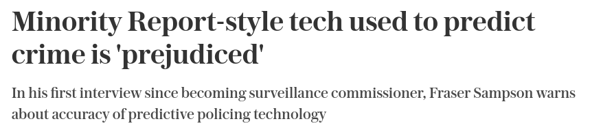

```{r setup, include=FALSE}
knitr::opts_chunk$set(echo = FALSE)
library(tidyverse)
```

# Introduction

## This course

$5 \times 3$ hour sessions, covering:

1. Introduction to ML and maximum likelihood estimation
2. ML extensions to regression
3. Tree-based methods
4. Neural networks
5. Ensemble methods

The logic:

* Understand the underlying mechanics of parameter estimation
* Start from a modeling strategy we are familiar with...
* ... and move on to algorithmically more complicated cases
* Build on the same foundational concepts across each day

## Balancing a course on machine learning

* ML is a broad and contested domain
  * Within each sub-domain, there is a lot of potential (mathematical) detail
  * Easy to get stuck in the thickets of estimation
  
* Shouldn't lose sight of practical research problems

* Therefore we will not cover some topics:
    
    * Unsupervised methods
    * Clustering algorithms
    * (Text-specific ML models)
    
This course prioritises:

* Intuitive understanding of popular ML methods

* Transferability of fundamentals across ML strategies

* Relevance to our social science research streams
    
## Session structure

Each session will be a mixture of:

* Lecture content and discussion

    * I will leave plenty of opportunities for questions
    * Building in some time for us to think through some applied problems
    
* Coding walkthroughs (approx. 1 hour)

    * Conducted in R using RStudio
    * Hands on experience using different algorithms
    * Many of which are very easy to implement
    
\vspace{1em}
**Slides and code are available at**:
\centering \url{https://github.com/tsrobinson/ox_ml22}

## Today's session

Goals are threefold:

1. Introduce the topic of machine learning

    * What is ML?
    * How do we distinguish it from statistics?
    * What sort of problems might we apply it to?

2. Introduce key conceptual distinctions we will make throughout the course

3. Introduce maximum likelihood estimation

    * A key way in which ML parameters are estimated
    * Build our own logistic regression estimator

# What is machine learning?

## (Machine) learning and statistics


> "There are two cultures in the use of statistical modeling to reach **conclusions from data**. One assumes that the data are generated by a given stochastic data model. The other uses algorithmic models and treats the data mechanism as unknown" -- Breiman 2001

\vspace{1em}

> "Statistical learning refers to a set of tools for modeling and understanding **complex** datasets. It is a recently developed area in statistics and blends with parallel developments in **computer science** and, in particular, machine learning" -- James et al. 2013

\vspace{1em}

> "Machine learning is a subfield of **computer science** that is concerned with building algorithms which, to be useful, rely on a collection of examples of some phenomenon..." -- Burkov 2019

## **Machine** learning

Expectation: I need a $1m super computer

Reality: It runs in minutes on a personal computer


## Why machine learning?

Machine learning can be:

* Powerful
  * With respect to computational efficiency
  
* Flexible
  * With respect to data generating processes 
  
* Reduce the burden on the researcher
  * With respect to both generating data and estimating models

But ML is not a panacea!

* Cannot solve problems of poor research design

* *Can* be a black box

## Machine learning and social science

ML can also introduce issues of its own:


\vspace{1em}




## Prediction and inference

$$
\hat{y_i} = \hat{\beta_0} + \hat{\beta_1}x_{1i}
$$

ML typically focuses on prediction problems instead of inference problems:

* **Inference**: estimating the size/direction of the relationship between variables ($\bm{\hat{\beta}}$ problems)
* **Prediction**: estimating some outcome, using the relationships between variables ($\bm{\hat{y}}$ problems)

These two facets are connected:

* Knowing the size/direction of (all) relationships -> predict the outcome
* But we rarely know the true model
* Sometimes we can get good at $\hat{\bm{y}}$ problems without knowing $\hat{\bm{\beta}}$

## Classification and prediction

Within $\bm{\hat{y}}$ problems, we can distinguish two types:

* **Prediction** -- estimating the value of a continuous variable (sometimes referred to as a "regression" problem) e.g.,

  * The ideology of a politician in 2D space
  
  * The number of votes received by a candidate
  
  

* **Classification** -- estimating which *class* of a category an observation belongs to, e.g.,

  * Party identity (Republican/Democrat/Libertarian/Independent)
  
  * The topic of a tweet (foreign/domestic, pro/con)
  
  * Recidivism

## $\hat{Y}$ and $\hat{X}$ problems

We can also think about where the prediction problem lies:

* $\bm{\hat{y}}$ problems are about the dependent variable

  * To predict the probability of revolution...
  
  * ... or the weather tomorrow
  
  * These are not necessarily inferential problems

* But there are $\bm{\hat{X}}$ (independent variables) problems too:

  * Dimensions of interest that may be important to our theory, but which are:
      * Not directly observable (i.e. latent)
      * Difficult to measure "by hand"

  * We can make predictions over $\bm{X}$ so we can test our inferential theory
  
## Supervised vs unsupervised methods

**Supervised methods**

\begin{columns}

\begin{column}{0.48\textwidth}
\begin{itemize}

\item \textbf{Training data} are a set of labelled examples, where $\bm{y}$ is our target prediction
\item We use these examples to ``learn" the relationship between $\bm{y}$ and $\bm{X}$
\item Then predict $\bm{y}$ for a \textit{new} unlabelled dataset (i.e. where the target variable is not observed)
\end{itemize}
\end{column}

\begin{column}{0.48\textwidth}

Learning the relationship:
\begin{equation*}
\underbrace{
\begin{bmatrix}
1 \\ 0 \\ 0 \\
\vdots \\
1 \\
\end{bmatrix}
}_{\mathbf{y}^{\text{TRAIN}}}
\underbrace{
\begin{bmatrix}
3.3 & 1.1 & 0 \\
2.7 & 0.8 & 0 \\
1.8 & 0.1 & 1 \\
\vdots & \vdots & \vdots \\
5 & 1.2 & 0 \\
\end{bmatrix}
}_{\mathbf{X}^{\text{TRAIN}}}
\end{equation*}

Predicting on new data
\begin{equation*}
\mathbf{X^{\text{TEST}}} =
\begin{bmatrix}
3.5 & 1.9 & 1 \\
5.4 & 0.3 & 0 \\
1.7 & 0.5 & 1 \\
\end{bmatrix}
\end{equation*}
\end{column}

\end{columns}

# Notation

## Algebra

Throughout the course, we will follow the notation set out in Burkov (2019):

* $\theta$ and $x$ are scalar - i.e. a single number
    
    * E.g., $\theta = 3.141$, $x = 1$ etc.
    
* $\bm{\theta}$ and $\bm{x}$ are vectors - i.e. an ordered list of scalar values

    * E.g., $\bm{\theta} = [0.5, 3, 2]$
    
* $\bm{\Theta}$ and $\mathbf{X}$ are matrices

    * E.g.,
$$
      \small
      \mathbf{X} = \begin{bmatrix}
      1 & 5 \\
      24 & -3
      \end{bmatrix}
$$
    
    * $\mathbf{x}^{(k)}$ is the $k$th column of $\bm{X}$
    * $\mathbf{x_i}$ is the $i$th row in matrix $\mathbf{X}$
    * $x_i^{(k)}$ is the $k$th element of the row vector $\bm{x_i}$


## Probability notation

Let $p$ denote a probability distribution *function* that returns the probability of an event or observation:

* $p(A) = 0.5$ means the probability of event $A$ is 0.5

* All probabilities are bounded between 0 and 1

  * $0 \leq p(A) \leq 1$

Conditional probabilities means the probability of an event **given** the value of another variable  

*  $p(A| c) = 0.25$

## Probability rules

Probabilities have some nice features:

* $p(A \text{ and } B) = p(A)p(B|A)$

* If $p(A) \perp p(B)$, then $p(B|A) = p(B)$

As a result:

* If $p(A) \perp p(B)$, then $p(A \text{ and } B) = p(A)p(B)$

* These rules explain why the probability of two coin-flips is = 0.25:
  * $P(\text{Flip 1 = Heads})$ = 0.5
  * $P(\text{Flip 2 = Heads} | \text{Flip 1 = Heads}) = P(\text{Flip 2 = Heads})$
  * $P(\text{Flip 1 = Heads *and* Flip 2 = Heads}) = 0.5 \times 0.5 = 0.25$


    
## Notation quiz

What are the following:

1. $\mathbf{a}$
2. $y_i$
3. $\bm{\beta}$
4. $\beta$
5. $\bm{\Theta}$

\vspace{1em}

If $p(A) = 0.5$, $p(B) = 0.1$, and $p(B|A) = 0.3$:

6. Is $p(A) \perp p(B)$?
7. What is $p(A\text{ and }B)$?

# Maximum Likelihood Estimation (a gentle introduction)

## Bayes Theorem (from a frequentist perspective)

$$
\underbrace{P(A|B)}_\text{Posterior} = \frac{\overbrace{P(B|A)}^\text{Likelihood} \times \overbrace{P(A)}^\text{Prior}}{\underbrace{P(B)}_\text{Evidence}}
$$

We can use Bayes formula to estimate the posterior probability of some parameter $\bm{\theta}$:

$$p(\bm{\theta} | \mathbf{X}) \propto p(\mathbf{X}|\bm{\theta}) \times p(\bm{\theta}),$$

where $\mathbf{X}$ is the data.

## Likelihood function

Let's suppose that we have no prior knowledge over $\bm{\theta}$, so we'll drop the prior and focus specifically on the likelihood:

$$
\mathcal{L}(\bm{\theta}) = p(\mathbf{X} | \bm{\theta})
$$
*How would we calculate this?*

$$
\begin{aligned}
\mathcal{L}(\bm{\theta}) &= p(\mathbf{x_1}|\bm{\theta}) \times p(\mathbf{x_2}|\bm{\theta}) \times \ldots \times p(\mathbf{x_n}|\bm{\theta})\\
&=\prod_{i=1\ldots N} p(\mathbf{x}_i | \bm{\theta})
\end{aligned}
$$
i.e. the product of the probability of each observations within $\mathbf{X}$, given $\bm{\theta}$.

\centering\textit{What does this assume?}

## Comparing likelihoods

Suppose we have two alternative values of $\bm{\theta}$: $\bm{\theta^{(1)}}, \bm{\theta^{(2)}}$. We can calculate the likelihood *ratio* (LR) of these two possible parameter values:
$$
LR = \frac{\mathcal{L}(\bm{\theta^{(1)}})}{\mathcal{L}(\bm{\theta^{(2)}})}
$$

*If LR > 1, which parameter value would we pick?*

## Maximum likelihood estimation

We can generalise this for all possible values of $\theta$:

$$
\operatorname*{arg\,max}_{\bm{\theta} \in \Theta} \mathcal{L}(\bm{\theta}) = \prod_{i=1\ldots N} p(\mathbf{x}_i|\bm{\theta})
$$
i.e., from the set of all possible parameter values $\Theta$, find the parameter value that maximises the likelihood function.

Hence, **maximum** likelihood estimation.

* How we calculate $p(\mathbf{x}_i | \bm{\theta})$ will depend on the functional form of the underlying distribution

* We'll explore this specifically with respect to logistic regression later on today

*Why is this maximum likelihood a useful concept?*

## Numeric overflow

Multiplying many small numbers means we soon lose the power to calculate them precisely

* $\texttt{R}$ double-precision numbers range from $2 \times 10^{-308}$ to $2\times 10^{308}$

* If 400 observations have $p_{\bm{\theta}} = 0.01$, $\mathcal{L}(\bm{\theta})$ will be outside the computable range

What if we take the log?

* The log function is strictly increasing
* $Log(a \times b) = Log(a) + Log(b)$ so we can simply add the values

With the logged likelihood function we do not have the problem of numeric overflow!

## Negative log-likelihood

We can also calculate the *negative* log-likelihood:

* I.e. put a minus sign in front!

* We then *minimise* the negative log-likelihood

* We typically want to minimise rather than maximise because many of our procedures for optimisation are based on the former

* But, broadly, this is just semantics:
      
  * Minimising the negative log-likelihood is the same as maximising the log-likelihood

## Logistic regression

Logistic regression:

* Allows us to estimate $\bm{\beta}$ parameters when we have a binary outcome variable

* More broadly, it is a **binary classification** algorithm -- what is the probability that $y_i = 1$ given a vector of features $\mathbf{x_i}$?

We can write the logistic regression function as,
$$
f_{\bm{\theta},b}(\mathbf{X}) = \frac{1}{1+e^{-(\bm{\theta}\mathbf{X}+b)}}.
$$

The goal is to find the *best* values of $\bm{\theta}$ and $b$ that "explains" the data

  * Let's include b within $\bm{\theta}$ s.t. $\bm{\theta} = [b, \theta_1,\cdots,\theta_k]$

## MLE of logistic regression

For a given vector of scalar values $\bm{\theta}$, we can ask what the likelihood of the data is given those values

How do we construct this?

* If $y_i = 1$, we want the $f_{\bm{\theta}}(\mathbf{x_i})$

* But if $y_i = 0$ we want the inverse, i.e. $(1-f_{\bm{\theta}}(\mathbf{x_i}))$

* We can combine these two using a mathematical "logic gate":
$$
\mathcal{L}_{\bm{\theta}} = f_{\bm{\theta}}(\mathbf{X})^{\bm{y}} \times (1-f_{\bm{\theta}}(\mathbf{X}))^{(1-\bm{y})},
$$
  as when $y_i = 0, x^{y_i} = 1$ and $x^{(1-y_i)} = x$, and vice versa.
  
Simplifying, since $f_{\bm{\theta}}(\bm{x_i}) = \hat{y}_i$:
$$
\mathcal{L}_{\bm{\theta}} = \hat{\bm{y}}^{y}(1-\hat{\bm{y}})^{1-y}
$$
  
## MLE optimization

We can then apply our "tricks" to make the computation easier:
$$
-Log(\mathcal{L}_{\bm{\theta}}) = -\sum_{i=1}^NLog\big(\mathcal{L}_{\bm{\theta}}(\mathbf{x_i})\big), 
$$
with the goal of minimising this quantity through choosing $\bm{\theta}$.

How exactly do we minimize this function?

* Unlike OLS, where there is a closed form solution, it is not possible to analytically minimize the negative log-likelihood of the logistic regression

* We therefore have to use computation to iterate through values of $\bm{\theta}$ to approximate the minima


## Minimising the negative log-likelihood in one dimension

```{r min_loss, warning=FALSE, message=FALSE,fig.align='center', out.width = "98%"}

ggplot(data = data.frame(x = 0), mapping = aes(x = x)) +
  stat_function(fun = function(x) (25-10*x), color = "red", size = 1.5) +
  stat_function(fun = function(x) (x-5)^2, size = 1.2) +
  
  geom_linerange(x = 0, ymin = 0, ymax = 25, linetype = "dashed", size = 1.2) +
  geom_segment(x=-2.5,xend=0,y=25,yend=25, linetype = "dashed", size = 1.2) +
  geom_point(x = 0, y = 25, color = "red", size = 2) + 
  xlim(-2,10) +
  ylim(0,50) +
  labs(y = "Neg. Log-Likelihood", x = expression(theta)) + 
  theme_minimal() +
  theme(text = element_text(size = 20))
```
## Gradient descent algorithm

To find the minimum of the negative log-likelihood we:

1. Choose a value for the starting parameter $\theta$
2. Calculate the slope of the function at that point
3. Adjust our value of $\theta$ in the *opposite* direction to the slope coefficient's sign
4. Recalculate the slope, and repeat 2-4

We can generalise this to $\bm{\bm{\theta}}$:

* Let $Q(\bm{\theta})$ be the negative log likelihood function
* Calculate the **gradient** vector of the function in $k$-dimensions
* Adjust each parameter $\theta_k \in \bm{\theta}$ by the negative of the corresponding gradient element

$$
\theta_k = \theta_k - \frac{\partial Q(\bm{\theta})}{\partial \theta_k}
$$

## Logistic regression gradient

The partial derivative for any predictor $\bm{x}^{(j)}$ for the *logistic* cost function is:
$$
\frac{\partial Q^\text{Logit}}{\partial\theta_k} =  \big(f_{\theta_k}(\bm{X})-\bm{y}\big)\bm{x}^{(k)}
$$

Hence the gradient of the function's curve for any vector of logistic parameters $\bm{\theta}$ can be described as:

$$
\bm{\nabla} = \begin{bmatrix}
\frac{\partial Q^\text{Logit}(\bm{\theta})}{\partial\theta_1} \\
\frac{\partial Q^\text{Logit}(\bm{\theta})}{\partial\theta_2} \\
\vdots \\
\frac{\partial Q^\text{Logit}(\bm{\theta})}{\partial\theta_k}
\end{bmatrix}
$$


## Progression of the descent algorithm

```{r min_loss2, warning=FALSE, message=FALSE,fig.align='center', out.width = "98%"}

ggplot(data = data.frame(x = 0), mapping = aes(x = x)) +
  stat_function(fun = function(x) (25-10*x), color = "red", size = 1.5) +
  stat_function(fun = function(x) (2*x-11), color = "orange", size = 1.5) +
  stat_function(fun = function(x) (4.75-x), color = "green", size = 1.5) +
  stat_function(fun = function(x) (x-5)^2, size = 1.2) +
  
  geom_point(x = 0, y = 25, color = "red", size = 2) + 
  geom_point(x = 6, y = 1, color = "orange", size = 2) + 
  geom_point(x = 4.5, y = 0.25, color = "green", size = 2) + 
  xlim(-2,10) +
  ylim(-5,50) +
  labs(y = "Neg. Log-Likelihood", x = expression(theta)) + 
  theme_minimal() +
  theme(text = element_text(size = 20))
```

##

```{r local_min}
ggplot(data = data.frame(x = 0), mapping = aes(x = x)) +
  stat_function(fun = function(x) (cos(3*pi*x)/x + 3.5), color = "black", size = 1.2) +
  xlim(0.1,2) +
  geom_segment(x = 0.3, xend = 0.3, y = 6.25, yend = 0.5,
               arrow = arrow(length = unit(0.3, "cm")), size = 1.2) + 
  geom_text(x = 0.3, y = 6.5, label = "Global Minima", size = 5.3, fontface = "bold") + 
  
  geom_segment(x = 0.98, xend = 0.98, y = 7.75, yend = 2.75,
               arrow = arrow(length = unit(0.3, "cm")), size = 1.2) + 
  geom_text(x = 0.98, y = 8, label = "Local Minima", size = 5.3, fontface = "bold") + 
  
  
  labs(y = "Neg. Log-Likelihood", x = expression(theta)) + 
  theme_minimal() +
  theme(text = element_text(size = 20))
```


## Learning rate

As we iteratively adjust the value of our parameter:

* It's possible we keep jumping over the minima

* Or we get stuck in a rut and the estimator fails to find an even better parameter choice

So we can scale the impact of the current gradient on the new parameter choice:
    
  * Let's call this hyperparameter the **learning rate** ($\lambda$)
    
  * $\bm{\theta}_\text{New} = \bm{\theta} - \lambda\bm{\nabla}$
    
The choice of $\lambda$ is down to the researcher:

* Overly-large values will prevent minimisation

* Overly small values may take too long, or risk converging on *local* minima

## Stochastic gradient descent

Gradient descent can be **expensive**:

* We have to evaluate all rows in our training data before making any updates to the parameters

* If we have lots of observations

    1. Each calculation takes a long time
    2. Take many iterations to optimise
    
* Instead we can use **stochastic gradient descent** (SGD)

  * Inspect the loss of each observation (or a random subset) individually
  
  * Update the coefficients based on each observation
  
## Stochastic gradient descent

Under GD, for each iteration:
$$
\theta_k \leftarrow \theta_k + \lambda\sum^{N}_{i=1}(y_i - f_{\theta_k}(\bm{x_i}))\bm{x_i}^{(k)}
$$

Under SGD, for each iteration:
$$
\theta_k \leftarrow \sum_{i=1}^N \theta_k + \lambda(y_i - f_{\theta_k}(\bm{x_i}))\bm{x_i}^{(k)}
$$

* SGD typically converges a lot faster than GD

  * Every iteration we make $N$ small changes to the parameter estimate
  
  * Computationally more efficient (we'll cover this more later in the week)

  * At the cost of some additional noise in the optimisation process

# Coding workshop: writing our own logistic regression classifier


