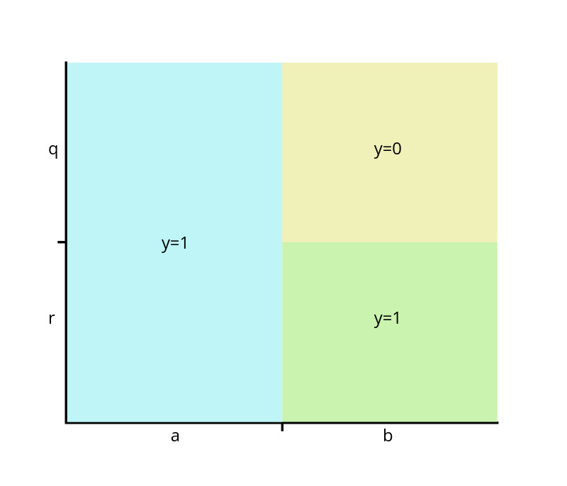

```{r setup, include=FALSE}
knitr::opts_chunk$set(echo = FALSE)
library(tidyverse)
```

## Recap

Over past two sessions:

* Got to grips with the foundations of machine learning

    * Gradient descent
    * Regularisation
    * Hyperparameter tuning
    
* Explored ML extensions to **linear** prediction strategies

  * LASSO as a regularised version of OLS
  * Other extensions like ridge regression

But what if we want to model unknown and potentially *complex* relationships?

* Multi-way interactions
* Unknown polynomial terms
* Non-parametric relationships

## Today's session

Explore a form of ML that helps find the optimal model:

* Uses "trees" to subdivide training data
* Making predictions on the basis of trained trees
* Same foundational ML concepts recur:

    * Regularisation
    * Hyperparameters 

Remainder of the session:

1. Introduction to decision trees
2. Random forest
3. Bayesian Additive Regression Trees

# Decision trees

## Motivation I

Consider the following data:

\small
| $y_i$ | $X_{1i}$ | $X_{2i}$ |
|:-:|:---:|:---:|
| 1 |  a  |  q  |
| 0 |  b  |  q  |
| 1 |  a  |  q  |
| 0 |  b  |  q  |
\normalsize

Suppose we observed the following new observation:

\small
| $y_j$ | $X_{1j}$ | $X_{2j}$ |
|:-:|:---:|:---:|
| ? |  a  |  q  |
\normalsize

* What is $\hat{y}_j$?

## Motivation II

Now consider this modified data:

\small
| $y_i$ | $X_{1i}$ | $X_{2i}$ |
|:-:|:---:|:---:|
| 1 |  a  |  q  |
| 1 |  a  |  q  |
| 1 |  a  |  r  |
| 0 |  b  |  q  |
| 0 |  b  |  q  |
| 1 |  b  |  r  |
\normalsize

\vspace{-1em}
Suppose we observed the following new observations:

\small
| $y_j$ | $X_{1j}$ | $X_{2j}$ |
|:-:|:---:|:---:|
| ? |  a  |  r  |
| ? |  b  |  r  |
\normalsize

\vspace{-1em}
* What are the predicted values here?

## Homogenous subsets of $\bm{X}$

\begin{columns}
\begin{column}{0.48\textwidth}

\textbf{Example 1}
\begin{itemize}
\item $\mathbb{E}[Y|X_1 = a] = 1$
\item $\mathbb{E}[Y|X_1 = b] = 0$
\end{itemize}

\vspace{5em}
\textbf{Example 2}
\begin{itemize}
\item $\mathbb{E}[Y|X_1 = a, X_2 = q] = 1$
\item $\mathbb{E}[Y|X_1 = b, X_2 = q] = 0$
\item $\mathbb{E}[Y|X_1 = a, X_2 = r] = 1$
\item $\mathbb{E}[Y|X_1 = b, X_2 = r] = 1$
\end{itemize}
\end{column}

\begin{column}{0.48\textwidth}

\begin{tabular}{ccc}
\toprule
$Y_i$ & $X_{1i}$ & $X_{2i}$ \\
\midrule
 1 &  a  &  q  \\
 0 &  b  &  q  \\
 1 &  a  &  q  \\
 0 &  b  &  q  \\
 \bottomrule
\end{tabular}

\vspace{1em}

\begin{tabular}{ccc}
\toprule
$Y_i$ & $X_{1i}$ & $X_{2i}$ \\
\midrule
1 &  a  &  q  \\
1 &  a  &  q  \\
1 & a & r \\
0 &  b  &  q  \\
0 & b & q \\
1 &  b  &  r  \\
\bottomrule
\end{tabular}

\end{column}
\end{columns}

## Prediction via subsetting

Tree-based ML methods make predictions on the basis of subsetting the data:

1. We start with training data $\bm{X}$
2. Choose a variable $\bm{X}_j$
3. Split $\bm{X}_j$ at some point $c$ along that dimension
4. Either:
  
    a. Calculate the conditional mean for each of the two splits
    b. Repeat steps 2-3 

## Graphical depiction of a tree

Using the data from the second example yields a decision tree:

\begin{center}
\begin{tikzpicture}
  [
    grow                    = right,
    sibling distance        = 6em,
    level distance          = 8.6em,
    edge from parent/.style = {draw, -latex},
    every node/.style       = {font=\normalsize},
    sloped
  ]
  \node (data) [env] {$X_1 = a$?}
    child { node [env] {$X_2 = q$?}
      child { node [dummy] {$\bar{y} = 1$}
        edge from parent node [below] {No} }
      child { node [dummy] {$\bar{y} = 0$}
        edge from parent node [below] {Yes} }
              edge from parent node [above] {No} }
    child { node [dummy] {$\bar{y} = 1$}
              edge from parent node [above] {Yes} };
\end{tikzpicture}
\end{center}

## Tree terminology

**Decision Node**

* A junction in the network where we split the data in two

* Requires some splitting rule or decision

**Branch**

* A path along the tree

**Terminal node** or "leaf"

* The final node along a tree branch (i.e. no further splits)
* Returns a prediction or label for $y$

**Depth**

* The maximum number of nodes between the "root" node (i.e. original full data) and a leaf node

## Alternative visualisation

```{r, echo=FALSE, out.width="80%", fig.cap="Partitioning the feature space"}

```

## Building classification and regression trees

A single-tree model trained on data $\bm{X}$ to make predictions about data $\bm{X'}$

* There are two types depending on the prediction problem:

  * **Classification trees**: predict which *class* an observation belongs to (i.e. $\bm{y}$ is a vector of labels)

  * **Regression trees**: predict the outcome of an observation (i.e. $\bm{y}$ is a continuous variable)

Across both types, model training determines:

* Structure of the tree

* The variable to split on at each decision node

* The splitting criteria $c$ at each decision node

This is algorithmically more complicated than the ML extensions of OLS regression

## Classification problems

**Training objective**: minimise the classification error for $\bm{y}$ corresponding to training data $\bm{X}$

Intuitively, we want to select features of $X$ such that:

* Dividing on those features yields more *certain* predictions about $\bm{y}_k$ for each $k$

We call the increase in certainty as a result of splitting on a variable the **information gain**, denoted as 
$$IG = I(\bm{y}^\text{Parent}) - \bigg( \frac{n_\text{Left}}{n_{\bm{y}^\text{Parent}}}I(\bm{y}^\text{Left}) + \frac{n_\text{Right}}{n_{\bm{y}^\text{Parent}}}I(\bm{y}^\text{Right}) \bigg)
$$
In turn, this will depend on:

* The function $I()$
* The variable we split on
* The threshold that determines the split between Left and Right

## $I()$ as the Gini Index

For classification trees, $I()$ is typically the **Gini Index**

* A measure of inequality
* Substantively used to measure income inequality in countries
* Countries with income equality have Gini Index value nearer 0
* Useful for our purposes because we want greater equality between observations within a partition of $\mathcal{R}$

The Gini Index is calculated as:
$$
I_\text{Gini}(\bm{y}) = \sum_a{P(\bm{y} = a)(1-P(\bm{y}=a))}
$$

* With two classes and $P(\bm{y} = 1) = 1, I_\text{Gini} = 0$
* With two classes and $P(\bm{y} = 1) = 0.5), I_\text{Gini} = 0.5$

## Classification algorithm

We start with the full data $\bm{X}$:

1. For every possible variable, and splitting point in each variable, split the data and calculate the information gain

2. Choose the variable and splitting value which yields the greatest information gain

3. Repeat this process recursively for each partition of data

Clearly this results in a branching structure!

* But how do we know when to stop?

## Stopping criteria

The algorithm will stop automatically when when $I(\bm{y}^\text{Parent}) = 0$

But with some small residual inequality we could get very deep networks, raising a familiar problem of **overfitting**

* I.e. we need to add some form of regularisation

Various hyperparameter options:

* Stop splitting after $\lambda$ decision nodes
* Stop splitting when there are fewer than $\lambda$ observations in a subset

Alternatively we can "prune" a deep tree:

1. Hold out some validation data and train the model on the remaining training data
2. Successively remove splits from the trained model ("pruning") and calculate the classification error 
3. Choose the pruned tree with the lowest classification error

## Prediction (regression) problems

**Training objective**: minimise the *prediction* error for $\bm{y}$ corresponding to training data $\bm{X}$

One obvious candidate to focus on:
$$
\text{Prediction error} = \sum_{i=1}^N(y_i-\hat{y}_i)^2,
$$
where
$$
\hat{y}_i = \frac{1}{\sum_i\mathbb{I}(\bm{x}_i \in \mathcal{R}_k)} \times \sum_i{\mathbb{I}(\bm{x}_i \in \mathcal{R}_k)y_i}
$$

* Same idea as linear regression but not identical
* We recursively partition the data so that the split at node $k$ only uses the data from its parent node

## Regression algorithm

We start with the full data $\bm{X}$:

1. For every possible variable, and splitting point in each variable, split the data and calculate the conditional mean for the two branches: $\beta_\text{Left}, \beta_\text{Right}$

2. Calculate the total loss as,
$$
\sum_{i \in \bm{X}^{Left}}{(y_i - \beta_\text{Left})^2} + \sum_{i \in \bm{X}^{Right}}{(y_i - \beta_\text{Right})^2}
$$

3. Choose the variable and splitting value which yields the smallest total squared loss

3. Repeat this process recursively for each new partition of data

## Benefits and limitations of CART

**Benefits**

* Reasonably intuitive and interpretable
  * We can inspect the tree structure and make meaningful claims about the "role" of variables
* Easy to compute
  * Even with continuous predictors we only consider unique cases in the data
* Flexible -- can model complex relationships reasonably well

**Limitations**

* It relies on a **greedy** algorithm
    * We fix the first split of the data
    * Then we find the best split conditional on that first split
    * Not necessarily optimal tree structure

* CART is a heuristic approach

# Random forest

## From one tree to a forest trees

CART is a simple ML procedure, but being "heuristic" in form means it is quite limited:

* Finding the optimal network structure is just computationally very difficult

  * Entails considering how any specific splitting rule affects the tree structure as a whole
  
  * Leads to an explosion of parameter combinations to consider

Random forests are an extension of CART models, and rests on two major alterations to the estimation strategy:

1. The number of trees estimated

    * Forest methods rely on fitting multiple trees to improve predictive performance
  
2. How individual trees grow

    * Randomising splitting decisions to regularise the estimation

## Deterministic individual trees

Individual tree models are deterministic:

* Suppose we have training $\bm{X}^\text{Train1}$ and $\bm{X}^\text{Train2}$, and some constant test dataset $\bm{X'}$

* Let $\hat{f}_{\bm{X}^\text{Train1}}$ and $\hat{f}_{\bm{X}^\text{Train2}}$ be the trained CART models for the two training datasets

If  $\bm{X}^\text{Train1} = \bm{X}^\text{Train2}$,

* $\hat{f}_{\bm{X}^\text{Train1}}(\bm{X'}) = \hat{f}_{\bm{X}^\text{Train2}}(\bm{X'})$

But if $\bm{X}^\text{Train1} \neq \bm{X}^\text{Train2}$,

* $\hat{f}_{\bm{X}^\text{Train1}}(\bm{X'})$ and $\hat{f}_{\bm{X}^\text{Train2}}(\bm{X'})$ likely differ

If we want to leverage multiple trees, we need multiple *different* training datasets 

## Bootstrapping

Collecting masses of new training data would be inefficient, expensive, and suggest you don't need ML at all!

One statistical way to generate multiple datasets is to "bootstrap" $\bm{X}$

* Ramdomly *sample with replacement* datasets of the same size as $\bm{X}$
* Some $\bm{x_i} \in \bm{X}$ can appear more than once in a bootstrapped dataset
* In other words, we are going to pretend $\bm{X}$ is a population, and take new random samples from it

Since $\{\bm{X^1},\bm{X^2},..., \bm{X^B}\}$ will be (slightly) different:

* Training models on each will yield (slightly) different model predictions
* And hence we get a "forest" of predictions

## Averaging across the forest

Random forest estimators estimate T separate trees, by bootstrapping $\bm{X}$

* To get a final prediction, we pass our test data $\bm{X'}$ through each of the T trees, 

* Recover the $T$ corresponding estimates for each observation

* And take the average

$$
\hat{\bm{y}}= \frac{1}{T}\sum_{t=1}^T{\hat{f}_t(\bm{X'})},
$$

where $\hat{f}_t$ is the $t$th trained tree model in the forest

## Regularisation: Feature bagging

Unlike CART models, random forest does not employ pruning or maximum depth hyperparameters:

* We allow each individual tree to grow to its full length
* Individual trees may be overfit...
* ... but averaging across tree models helps smooth this overfitting

Instead, random forests randomises which variables are available at each non-terminal node:

* Involves setting a hyperparameter $m$:
    * The number of variables to be chosen at random for each decision node
* Forces different trees to learn different aspects of the relationship between $\bm{y}$ and $\bm{X}$
* Counteracts the "greedy" nature of CART estimation

## Recap of random forest estimation

Procedure:

1. Take $T$ bootstrapped samples of training data $\bm{X}$
2. For each sample $b$, estimate a single decision tree
  
  * At each splitting decision, randomly sample $m$ variables and choose best variable and splitting value from this subset
  
3. Allow each tree to grow to full-length
4. Pass $\bm{X'}$ through *each* tree in the forest
5. Average the resultant predictions across each tree

## Benefits of random forest

Since averaging helps smooth overfitting, we can allow each tree to be deeper than when using a single tree

  * I.e. allow each individual tree to be more complex
  * Out-of-sample accuracy should increase because we rely on not one, but many, trees to make the prediction!

Since we recover multiple estimates of $\hat{y}_i$, we can characterize the uncertainty of this prediction:

* For example, $\mathbb{V}(\hat{y}_i) = \frac{\sum_{t=1}^T\big(\hat{f}_t(\bm{x'_i}) - \hat{y}_i\big)^2}{t-1}$
* Or take 2.5th and 97.5th percentiles of distribution to construct a 95% interval

## Limitations

Some additional computational cost:

* We are not training 1 tree, we are likely training 1000!
* Slightly offset by restricting choice of variables at each decision node
* Algorithmic implementations of random forest are pretty fast

Interpretability:

* Cognitively, unlike CART, intepreting all the trees is near impossible
* Conceptually, too, individual tree structures are meaningless
    * We care about the average performance of the trees
    
Optimisation

* Averaging improves performance by lowering variance
  * But each tree is grown independently
  * What if we could optimise trees with respect to each other?

# Bayesian Additive Regression Trees

## An alternative forest

Random forests are not the only type of multi-tree method:

* Suppose each tree is tasked with predicting a small part of the covariance between $\mathbf{X}$ and $\mathbf{y}$

* Averaging no longer makes sense

* But we can *sum* these trees if they focus on different parts of the covariance. Hence, $\hat{y}_i = \sum_tf_t(\mathbf{x}_i)$

Ideally, each constituent tree within the forest will adapt to meet the predictive needs of the forest as a whole!

* This intuition combines the constrained nature of CART models...
* ...with the aggregate nature of random forests

## Bayesian Additive Regression Trees

**Bayesian Additive Regression Trees** (BART; Chipman et al 2010) is a forest methods that sums a set of "weak learner" trees

* Each tree is constrained to predict only a small portion of the total outcome

$$
f(\mathbf{X}) \approx \hat{f}(\mathbf{X}) = \sum^m_{j=1}g_j(\mathbf{X}, M_j, T_j),
$$
where:

  * $f(\mathbf{X})$ is the true functional relationship between $\mathbf{X}$ and $\mathbf{y}$
  * $m$ indicate the number of trees in the model
  * $g_j$ is the individual prediction from tree $j$
  * $M_j$ are the terminal node parameters of tree $j$
  * $T_j$ is the tree-structure of tree $j$ (i.e. the decision rules of the tree)
  
## BART regularisation

BART does not employ feature bagging or pruning to regularise the model

Instead we instantiate the model with a "prior" structure:

* A full (albeit bad) model exists prior to any training 
* We instantiate $M$ separate trees
* Each tree has a complete structure, including splits and terminal nodes
  
These priors act to *penalize* overly complex individual trees (more on why later)

<!-- Since each tree is optimized with respect to every other tree (we will discuss this in more depth later on), they will not have the "room to grow" fully -- unlike in random forests where each tree is grown independently. -->
  
## BART algorithm

**1. Forest instantiation**

* Tree structure prior over $T_j$ sets probability that each split in the tree is non-terminal

* The prior over each terminal node is denoted $\mu_{ij}$ and is drawn from a normal distribution
  
* BART model also assumes random DGP $f(\mathbf{X})$ and so sets a prior over this variance -- denoted $\sigma$
  
Note that these priors are drawn from **random** distributions. Hence, if we took multiple draws from the tree, we would get different values at the terminal nodes -- this is a very convenient property.

## Updating trees

**2. Iterate through each individual tree**

* Calculate the residual variance not explained by the remaining $m-1$ trees, i.e. $R_j = \mathbf{y} - \sum_{j' \neq j}f_j'(\mathbf{X})$

* The algorithm then proposes a new tree structure $T^*_j$ by:
    * **Growing** -- split a terminal node in two
    * **Pruning** -- remove child nodes
    * **Swapping** -- swap the split criteria for two non-terminal nodes
    * **Changing** -- alter the criteria for a single non-terminal node
    
* Then decide whether to *accept* $T^*_j$
    * A probabilistic choice based on the extent of residual variance $R_j$ and the initial tree $T_j$

* Proceed to the next tree in the forest

## Constrained optimization

Since $R_j$ encompasses the prediction of all but the tree under consideration, this updating procedure is constrained:

* Only focuses on a small portion of total variance
* I.e. that which *is not* explained by the remainder of the forest

**3. Update $\sigma$ and repeat**

With all trees updated, the model then attempts to optimize the forest as a whole by revising the $\sigma$ prior.

We then repeat steps 2-3 $N$ times

* $N$ is a hyperparameter chosen by the researcher

After $N$ repetitions, we have a trained prediction function $\hat{f}$.

## Predicting $\mathbf{y}$

To predict $\bm{y'}$ from $\bm{X'}$ we push each observation through the prediction function $\hat{f}$ *multiple* times

* Each time yields a different prediction given terminal nodes are random variables

* Typically we take 1000 draws from the prediction function

For every observation $\mathbf{x}_i$, we therefore have 1000 predicted values $\bm{\hat{y_i}}$:

* This is a distribution of the prediction for each $y_i$

* $\hat{y}_i = \frac{1}{N}\sum_ky_{ik} \sim \hat{f}(\mathbf{X})$

Similar to random forests, saving the full distribution gives us an idea of the uncertainty.

## Comparing random forests and BART

$\hat{y}_i^\text{RF}$ is the average over $k$ trees in the forest:

  * Each tree is a complete attempt to predict the outcome using bootstrapped data and feature bagging
  
  * Therefore, we average over the individual tree predictions of the outcome
  
$\hat{y}_i^\text{BART}$ is the average over $k$ draws from the estimated function $\hat{f}$

  * Each draw is the result of passing $\bm{x'}_i$ through the $m$ constituent trees and *summed*
  
  * Repeated $k$ times to generate $k$ predictions
  
  * Averaging over individual draws from the *forest* not individual trees
  
## Benefits of BART

One benefit of BART is that it is robust to the choice of hyperparameter values:

  * Empirically we find that small changes in the hyperparameters do not yield drastically different predictions
  
  * Good default estimator for predictive ML methods
  
  * Default hyperparameter provided by Chipman et al (2010) are typically going to perform well

