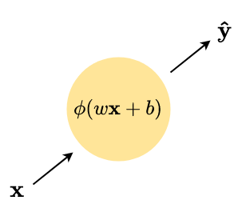

```{r setup, include=FALSE}
knitr::opts_chunk$set(echo = FALSE)
library(tidyverse)
```

## Recap

Yesterday's session, we covered non-parametric ML methods using trees

* The estimator does not require the model form to be pre-specified

* Complex relationships can be captured via a conjunction of splits

* Two different "forest" methods can improve on the performance of CART

## Today's session

Explore an even more flexible form of ML:

* Neural network architectures
* An "engineering-grade" solution
  * A lot more flexible in terms of abstract structure than forests
* Introduce the concept of deep-learning

Remainder of the session:

1. Simple neural networks
2. Deep learning
3. Different types of neural network
4. Example application in social science

# Neural network terminology

## Basic terminology

**Input**

* Data that forms an argument passed to the node

**Weight**

* A scalar that is *multiplied* with an input vector

**Bias**

* A scalar value *added* to the input vector

**Node**

* A computational unit that applies some function $f$ to inputs, weights and bias

**Output**

* The result of the function applied at a node -- typically another vector

## Simple perceptron model

Suppose we have a single vector of input data $\bm{x}$, and we want to predict the output $\bm{y}$

A simple perceptron model looks like the following:

{width=40%}

$w$ is the weight term and $b$ is the bias term -- in this simple case, both are scalar.


## Activation functions $\phi$

The activation function is simply a function applied to the result of $w\bm{x} + b$, that controls the range of the output vector

$\phi$ may simply be the **identity function**:

* I.e. $\phi(\bm{x}) = \bm{x}$

**Sigmoid function**:

* $\phi(\bm{x}) = \frac{1}{1 + e^{-\bm{x}}}$

**Rectified Linear Unit (ReLU)**:

* $\phi(\bm{x}) = \max(0,x)$

**Tanh**:

* $\phi(\bm{x}) = \frac{e^{\bm{x}} - e^{-\bm{x}}}{e^{\bm{x}} + e^{-\bm{x}}}$

These functions (and others) are particularly useful because they have known derivatives -- which we'll return to later!

## Gaining a prediction from our simple model

\begin{columns}
\begin{column}{0.4\textwidth}
\includegraphics[width = \textwidth]{images/sn_perceptron.png}
\end{column}
\begin{column}{0.48\textwidth}
Suppose:
\begin{itemize}
\item $\phi$ is the ReLU function
\item $\bm{w} = \bm{2}, b = 1$
\end{itemize}
\end{column}
\end{columns}

And we observe the following input vector $\bm{x}$:
$$
\begin{bmatrix}
5 \\
1 \\
-1 
\end{bmatrix}  
$$
What is $\hat{\bm{y}}$?

## Multiple inputs

The first model is very basic, so we can adapt it to accept **multiple** inputs:

* Let $k$ index input variables, i.e. $\bm{X} = \{\bm{x}_1,\ldots,\bm{x}_k\}$
* Let $\bm{w}$ be a vector of weights, i.e. $\bm{w} = \{w_1, \ldots, w_k \}$

Inside our activation function we replace $w\bm{x} + b$ with
$$
w_1\bm{x}_1 + \ldots + w_k\bm{x}_k + b \equiv \sum_k{w_k\bm{x}_k} + b
$$

{width=40%}

## Initialisation

Like BART (and unlike CART/RF) prior to training we build the model network

For a single-node perceptron model with $k$ inputs, that means instantiating the weights and biases

* A naive option sets $\bm{w} = \bm{0}$

  * This is rarely optimal -- it can lead to significantly slower convergence (and can even disrupt convergence entirely)
  
A now standard approach is to use **Xavier initialisation** where:
$$
w_k \sim \mathcal{N}(0,\frac{1}{k})
$$

  * where $k$ is the number of inputs to the node
  * Typically used when $\phi$ is tanh or sigmoidal
  * Bias terms are instantiated at zero


## Loss functions

The goal of the perceptron is to minimise the predictive error between $\bm{y}$ and $\bm{\hat{y}} = \phi(\sum_k{w_k\bm{x}_k} + b)$

Depending on the type of prediction problem, we want to use a different function:

**Continuous $\bm{y}$**

* $\phi$ will be linear or ReLU 
* Minimise the mean squared error
* I.e. $\frac{1}{n}\sum_{i=1}^{n}(y_i - \hat{y_i})^2$

**Binary $\bm{y}$**

* $\phi$ will be sigmoid
* Minimise using **cross-entropy** loss function
* I.e. $=-\frac{1}{N}\sum_{i=1}^n\sum_{c=1}^{C}{y_{ic}\log(\hat{y_{ic}})}$ 
    * where $c$ indexes the classes within the binary/categorical variable

## OLS/Logistic regression as a single-layer perceptron

We can construe OLS as a single-node perceptron model,
$$
\bm{y} = \phi(b + w_1\bm{x_1} + ... + w_k\bm{x_k}),
$$
when:

* $\phi$ is the identity function
* $\bm{w}$ is the regression coefficient vector
* $b$ is the intercept

and solved via MLE.

Similarly logistic regression is where $\phi$ is the sigmoid activation function.

## Limitations and extensions

A single-node perceptron model is not particularly exciting:

* With identity/sigmoid activation functions we get conventional estimators
* The model is linear in inputs

To complicate our models we need to think about creating a **network** of nodes

* Increase the number of computational units
* Determine the flow of information along the network

Similar to how tree-based methods add complexity by branching

* Multiple nodes, and interactions between nodes, allow us to model complicated relationships


# Deep learning

## Complicating the network

{width=80%}

## Deep neural network

{width=80%}

## Multi-layer network notation

The computation of outputs through layer $h$ of a neural network is:
\begin{align*}
\mathbf{y}^{(h)} = \sigma ( \mathbf{W}^{(h)} \mathbf{y}^{(h-1)} + \mathbf{b}^{(h)} ), \vspace{-1em}
\end{align*}
where:

* $\mathbf{y}^{(h)}$ is a vector of outputs from layer $h$
* $\mathbf{W}^{(h)}$ is a matrix of weights for layer $h$
* $\mathbf{b}$ is a vector of biases for layer $h$
* $\sigma$ is an activation function

This model can be generalized to an arbitrary number of hidden layers $H$:
\begin{align*}
\mathbf{y} = \Phi ( \mathbf{W}^{(H)}[...[\sigma ( \mathbf{W}^{(2)}  [\sigma (\mathbf{W}^{(1)} \mathbf{x} + \mathbf{b}^{(1)})] + \mathbf{b}^{(2)})]...] + \mathbf{b}^{(H)}),
\end{align*}
where $\mathbf{x}$ is a vector of inputs and $\Phi$ is a final-layer activation function.

## Fully-connected networks

In a fully connected network:

* Every output from layer $h$ is an input to every node in layer $h+1$

{width=80%}

## Feed-forward training

We initialise a multi-layer model like a single-layer model:

1. Set weight terms for each node within each layer via some initialisation function

During training, an **epoch** consists of:

2. Feeding every observation through the model
  * When there are no cycles in the network, this is called "feed-forward"

3. Calculate the loss associated with the prediction

4. Adjust weights and biases based on the gradient of the loss

  * This is complicated with multiple layers
  * Adjusting the weights and bias affects the output of a node.
  * ... and the input of the nodes (plural!) that it feeds into!

*Repeat steps 2-4 multiple times*


## Backpropagation

We calculate the loss as a function of the known outcomes ($\bm{y}$) and predicted output ($\hat{\bm{y}}$), plus a weight decay term to prevent overfitting:

$$
E = L(\mathbf{y}, \hat{\mathbf{y}}) + \lambda ||\mathbb{E}[\mathbf{W}]||_2
$$

To estimate gradient of the loss function, we can calculate it sequentially from the final layer to the first.

\vspace{1em}

Once the gradient is calculated, we adjust the weights by some scaled amount $\gamma$ (the learning rate):
$$
\Delta \mathbf{W}^{(h)} = - \gamma \frac{\partial E}{\partial \mathbf{W}^{(h)}}
$$

## Optimisation details

Through two applications of the chain rule, the change in loss due to the weights in layer $h$ is,
\begin{align}
    \frac{\partial E}{\partial \mathbf{W}^{(h)}} &= \frac{\partial E}{\partial \mathbf{y}^{(h)}} \cdot \frac{\partial \mathbf{y}^{(h)}}{\partial \mathbf{W}^{(h)}} \\
    &= \frac{\partial E}{\partial \mathbf{y}^{(h+1)}} \cdot \frac{\partial \mathbf{y}^{(h+1)}}{\partial \mathbf{y}^{(h)}} \cdot \frac{\partial \mathbf{y}^{(h)}}{\partial \mathbf{W}^{(h)}}.
\end{align}

Estimating the terms:

* $\frac{\partial E}{\partial \mathbf{y}^{(h+1)}}$ -- the derivative w.r.t. the outputs from the next layer
* $\frac{\partial \mathbf{y}^{(h+1)}}{\partial \mathbf{y}^{(h)}}$ -- the derivative of the next layer's activation function
* $\frac{\partial \mathbf{y}^{(h)}}{\partial \mathbf{W}^{(h)}}$ -- equal to $\mathbf{y}^{(h-1)}$, since $\mathbf{y}^{(h)}$ is the weighted sum of the inputs into layer $h$

## Recap of neural networks


# Neural networks in research/production workflows

## Advantages and Limitations

Deep neural networks are extremely powerful

* Currently in use across industry to solve prediction problems
* Help make film recommendations, target ads, predict complex physical processes 

Neural networks rest on the aggregated power of many simple models

* Each node is a linear combination of inputs
* Each activation function will have known derivatives etc.


But deep neural networks are **black boxes**

* The hidden layers are near-unintelligible in substantive terms
* We still do not fully understand their performance!

## "Engineering-grade" solution: design

Neural networks have huge design degrees of freedom 

* Number of nodes
* Number of layers
* Activation functions
* Connections between nodes
  * Feed-forward or recurrent?
  * Fully-connected?
* The number of networks (!)
* The number of training epochs

We can construct different structures to help us solve different types of problem

* We'll explore a few types in remainder of this session

## "Engineering-grade" solution: computation (2021)

Neural network technology is rapidly developing

* We can parallelise operations over CPUs and GPUs
* Use of algebraic objects like tensors make computation efficient
  * And corresponding new technology like tensor processing units (TPUs)
  


## "Engineering-grade" solution: computation (2022)

Neural network technology is rapidly developing

* We can parallelise operations over CPUs and GPUs
* Use types of algebraic objects like tensors make computation efficient
  * And corresponding new technology like tensor processing units (TPUs)
  


## Learning data representations: Autoencoders

Classical autoencoders consist of two parts.

\vspace{1em}

An \textit{encoder} deterministically maps an input vector $\mathbf{x}$ to a lower-dimensional representation $\mathbf{y}$:
\small
\begin{align*}
\mathbf{y} = f_\theta(\mathbf{x}) = \sigma( \mathbf{W}^{(B)}[...[\sigma ( \mathbf{W}^{(2)}  [\sigma (\mathbf{W}^{(1)} \mathbf{x} + \mathbf{b}^{(1)})] + \mathbf{b}^{(2)})]...] + \mathbf{b}^{(B)}),
\end{align*}
\normalsize
where $B$ is the "bottleneck" layer consisting of fewer nodes than the input layer.

\vspace{1em}
A \textit{decoder} then maps $\mathbf{y}$ back to a reconstructed vector $\mathbf{z}$ of the same dimensions as $\mathbf{x}$:
\scriptsize
\begin{align*}
\mathbf{z} = g_{\theta^\prime} (\mathbf{y}) = \Phi ( \mathbf{W}^{(H) \prime}[...[\sigma ( \mathbf{W}^{(B+2) \prime}  [\sigma (\mathbf{W}^{(B+1) \prime} \mathbf{y} + \mathbf{b}^{(B+1) \prime})] + \mathbf{b}^{(B+2) \prime})]...] + \mathbf{b}^{(H) \prime})
\end{align*}

## Autoencoder graph


## Uses and limitations of classical autoencoders

Autoencoders perform dimensionality reduction:

* Find a lower-dimensional representation $\mathbf{y}$ that captures the "essence" of $\mathbf{x}$
* Could be repurposed for finding latent concepts in social science
  * Where decoding element is not necessary

It is quite easy to learn/approximate the **identity function**:

* Combination of nodes perfectly reconstructs input through layers of the network
* Leads to loss values of zero in-training
* And likely very poor performance out-of-sample
* I.e. overfitting

*When we face a problem of overfitting what do we do?*

## Denoising autoencoders as regularised autoencoders

Denoising autoencoders corrupt the input:
$$\mathbf{x} \rightarrow \tilde{\mathbf{x}} \sim q_D (\mathbf{x}|\tilde{\mathbf{x}}).$$ 

The corrupted input is then mapped to a hidden representation 
$$\mathbf{y} = f_{\theta}(\tilde{\mathbf{x}}),$$ 
from which a clean or ``denoised'' version is reconstructed:
$$\mathbf{z} = g_{\theta^\prime}(\mathbf{y}).$$

Unlike before, $\mathbf{\hat{y}}$ is now a deterministic function of $\tilde{\mathbf{x}}$ (not $\mathbf{x}$).

* Loss is calculated with respect to the original input data $\bm{x}$ and "cleaned" data
* Hence learning identity function is not optimal in training

## Dropout as additional regularisation

We can also regularise the *nodes* of our network, via a process called **dropout**:

* We randomly "drop" nodes from the network
* This occurs randomly for each epoch and draw
* Goal is to force the network to model a distribution of functions that describe the data

Dropout has the effect of:

* Increasing the uncertainty of our model
* Making the predictions *stochastic*
* Approximating a **Gaussian Process**

## Example of training **without** dropout


## Example of training **with** dropout


## Takeaways

Notice that **without** dropout:

* Decline in loss is initially steeper
* Validation loss starts to stabilise while training loss continues to decrease
* A sign of overfitting!

**With dropout**:

* Model takes longer to reduce the loss
* But we avoid overfitting (over the same number of epochs)
* Example of better regularisation

## MIDAS neural network ([Lall and Robinson 2022](https://doi.org/10.1017/pan.2020.49)) \hyperlink{midas_details}{\beamerbutton{More information}}


# Application: Neural networks and text

## How similar are two words?


## Word embeddings

We can generalise this idea:

* Represent each word as a vector through K-dimensional space
* Expect that similar words will have more similar vectors

$$
King - Man + Woman = Queen
$$

## Dimensionality reducing

Embeddings are **dense** representations of words using numbers:

* Dimensionality-reducing (compared to a sparse representation)

\begin{table}[]
\begin{tabular}{lcccccccc}
\hline
& \multicolumn{4}{c}{\textbf{Sparse}} & & \multicolumn{3}{c}{\textbf{Dense}} \\
\cline{2-5} \cline{7-9}
word     & $k_1$ &  $k_2$  &  $\ldots$ & $k_V$ & & $e_1$ &  $e_2$  & $e_3$   \\
\hline
a        & 1 & 0 & $\ldots$ & 0 & & 0.89 & 0.5 & 0.23 \\
aardvark & 0 & 1 & $\ldots$ & 0 & & 0.01 & 0.88 & 0.78 \\
$\ldots$ & $\vdots$ & $\vdots$  &  $\ddots$   & $\vdots$ & & $\vdots$ & $\vdots$ & $\vdots$  \\
zyzzyva  & 0 & 0 & $\ldots$ & 1 & & 0.03 & 0.79 & 0.66 \\
\hline
\end{tabular}
\end{table}

## Representing an embedding dimension as a network weight

We saw with autoencoders that NN's can be used to perform dimensionality reduction

* Word embeddings extend this logic
* Use weight vector in a feed-forward neural network to store embedding values for each word


## Word embedding as a matrix

This process is repeated for each embedding dimension

* We can stack the weights for the layer as a matrix
* Given one-hot input, we return one column per word...
  
  * The word embedding vector!


## Word embeddings as a lookup table

As we change our input word, we get the corresponding word vector

* $\mathbf{Ex'}$ is a lookup table


## Estimating the embeddings

The challenge is to estimate these weights, but at present we have an incomplete model:

* No output vector
* No loss function
* No error to backpropagate

Mikolov et al (2013) come up with innovative solution:

* Given a **centre** word, predict the **context** word around it -- **skipgram** model
* Sequentially move a **window** through text, creating new (centre, context) pairs
* Backpropagate loss between predicted and actual context words

## A skipgram word embeddings model


## Advances and Examples

[Rodriguez and Spirling (2022)](https://doi.org/10.1086/715162)

* "What Works, What Doesn’t, and How to Tell the Difference for Applied Research"

[Genaro and Ash (2022)](https://doi.org/10.1093/ej/ueab104) 

* "Emotion and Reason in Political Language"

[Bellodi (2022)](https://doi.org/10.1111/ajps.12695)

* "A Dynamic Measure of Bureaucratic Reputation: New Data for New Theory"

# Extra slides

## MIDAS software in Python and R
\label{midas_details}

](images/MIDASpy_logo.png){width=25%}

\vspace{1em}

](images/rmidas_logo.png){width=15%}

## MIDAS network with dropout

Dropout involves multiplying outputs from each layer by a Bernoulli vector $\mathbf{v}$:
$$\tilde{\mathbf{y}}^{(h)} = \mathbf{v}^{(h)} \mathbf{y}^{(h)}, \mathbf{v}^{(h)} \sim \text{Bernoulli}(p).$$

* When $v^{(h)}_i = 0$ then that output adds nothing to any connected nodes in the next layer

The trained denoising encoder with dropout can thus be described as:
\footnotesize
\begin{align*}
\tilde{\mathbf{y}} = f_\theta(\tilde{\mathbf{x}}) = \sigma( \mathbf{W}^{(B)} \mathbf{v}^{(B)} [...[\sigma ( \mathbf{W}^{(2)} \mathbf{v}^{(2)}  [\sigma (\mathbf{W}^{(1)} \tilde{\mathbf{x}} + \mathbf{b}^{(1)})] + \mathbf{b}^{(2)})]...] + \mathbf{b}^{(B)}).
\end{align*}

\normalsize
The decoder, in turn, becomes:
\scriptsize
\begin{align*}
\mathbf{z} = g_{\theta^\prime} (\tilde{\mathbf{y}}) = \Phi ( \mathbf{W}^{(H) \prime}[...[\sigma ( \mathbf{W}^{(B+2) \prime}  [\sigma (\mathbf{W}^{(B+1) \prime} \tilde{\mathbf{y}} + \mathbf{b}^{(B+1) \prime})] + \mathbf{b}^{(B+2) \prime})]...] + \mathbf{b}^{(H) \prime})
\end{align*}
\normalsize
where $g \mathrel{\dot\sim} \text{GP}$ and $\mathbf{z}$ represents a fully observed vector containing predictions of $\tilde{\mathbf{x}}_\text{obs}$ and $\tilde{\mathbf{x}}_\text{mis}$. 

## MIDAS activation functions

MIDAS uses the exponential linear unit as its default activation function

* Facilitates efficient training in deep neural networks

The final-layer activation function is:

* Identity if $\mathbf{x}$ is continuous
* Logistic if $\mathbf{x}$ is binary
* Softmax if $\mathbf{x}$ is categorical

MIDAS measures loss with respect to deliberately corrupted values only ($\tilde{\mathbf{x}}_\text{obs}$) by multiplying by the corruption indicator $\mathbf{r}$

Loss calculations:
\small
\begin{align*}
L(\mathbf{x},\mathbf{z}, \mathbf{r}) =
\begin{cases}
[\frac{1}{J} \sum_{j=1}^J\mathbf{r}_j(\mathbf{x}_j-\mathbf{z}_j)^2]^{\frac{1}{2}} & \text{if $\mathbf{x}$ is continuous} \\
-\frac{1}{J} \sum_{j=1}^J \mathbf{r}_j[\mathbf{x}_j \log \mathbf{z}_j + (1-\mathbf{x}_j) \log (1-\mathbf{z}_j)] & \text{if $\mathbf{x}$ is categorical.}
\end{cases}
\label{eq:loss}
\end{align*}


## MIDAS algorithm


## Flexibily impute time trends

Existing strategies also struggle with non-exchangeable data

* E.g. panel data
* Most assume linear independence between observations
* Or require additional time polynomial terms
* MIDAS is complex enough to implicitly detect these trends

\vspace{-1.5em}


## Synthetic data

One particularly exciting avenue for neural net. applications is in "creative" tasks:

* Constructing more realistic vignettes
* Synthesizing data

Given some training data, how might we produce new data that have similar features (and covariances):

* Given a series of text, can we produce new "sensible" text?
* Given a set of images, can we create new and plausible images?

## Generative Adversarial Networks

The problem with synthetic data is that it requires labelling ``on the fly":

* What we want to validate is produced by the model itself
* Training would be slow if we have to hand-label the outputs!

Generative adversarial networks solve this problem by splitting in two:

* **Model A** is trained to *generate* new content based on some real examples $\bm{X}$
  * Denote this $\bm{X'}^{\text{Gen.}}$
  * Let $\bm{X'}$ be the set $\{\bm{X'}^{\text{Real}},\bm{X'}^{\text{Gen.}}\}$

* **Model B** is trained to detect whether some $\bm{x'} \in \bm{X'}$ is "Gen." or "Real"
  * Called the Discriminator model

## GAN optimisation

We have two networks with **competing** (hence adversarial) goals:

* **Model A** wants to maximise the error of **Model B**
* **Model B** wants to minimise its prediction error

When trained in tandem, **Model A** tries to create ever more realistic new observations that **Model B** cannot distinguish

* In turn, **Model B** gets more discriminant over time
* Forcing **Model A** to improve!

GAN-generated portraits:


