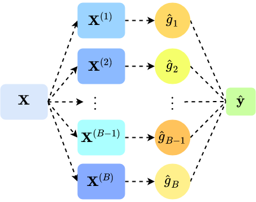
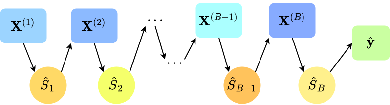
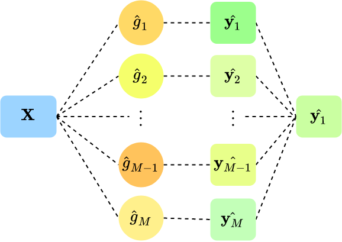

```{r setup, include=FALSE}
knitr::opts_chunk$set(echo = FALSE)
library(tidyverse)
```

## Recap

Over past three sessions:

* Explored three different broad categories of ML estimation:

  1. Extensions to OLS
  2. Tree-based methods
  3. Neural networks

Each attempt to make good out-of-sample in different ways, but share some foundational concepts:

* Bias-variance trade off
* Regularisation
* Hyperparameter tuning

How do we know which model to use and when?

* What if different models yield different predictions?

## Today's session

Introduce the concept of ensemble learning:

* Combine multiple estimators to *improve* the overall predictive performance

* Different estimators might capture different components of covariance

* Can we combine the methods into a "super-learner"?

Rest of the session:

1. Basic ensemble methods 
2. Superlearner theory
3. Causal inference and ML

## ML as learning

To go back to the fundamentals of ML:

* Different models represent different ways to *learn* the relationship between $\bm{X}$ and $\bm{y}$

  * By projecting points onto a lower dimensional surface (OLS)
  * By subsetting data into ever more homogenous groups (trees)
  * By approximating complex functional forms (neural nets?)
  
We can think about two levels of optimisation:

* $\operatorname*{arg\,min}_{\lambda,\theta} |f(\bm{X}) - \hat{g}_{\lambda,\theta}(\bm{X})|$
    * Solved algorithmically and via tools like cross-validation
  
* $\operatorname*{arg\,min}_{g} |f(\bm{X}) - \hat{g}_{\lambda,\theta}(\bm{X})|$
    * Need to estimate all $g \in \mathcal{G}$, and perform tuning within each $g$

## Generic meta-prediction problem

How can we optimise our choice of "learner" in order to best approximate the true data generating process?

  * Multiple strategies to choose from
  
  * Multiple specific estimators within strategies
  
**Naive approach:**

* Run multiple models, choose the one with lowest training error

* *Why might this not be the best strategy?*

## Combining models

Choosing a *single* best model may be suboptimal when:

* Different estimating strategies better estimate different parts of the outcome

The alternative is to combine models:

* We can average models together
* We can adapt models sequentially
* We can "weight" and sum models

*Do any of these sound familiar?*

Overarching intuition is to leverage the different capacities of an **ensemble** of models in order to improve prediction performance

## Ensemble methods

Three basic approaches to combining ML models

**Bagging**

  * "Bootstrap aggregation", random samples with replacement as training data
  * Typically used to reduce variance
    
**Boosting**

  * Sequential weak-learner models, data iteratively weighted by misclassification
  * Typically used to reduce bias
    
**Stacking**

  * Run different estimation strategies on the *same* training data, then combine estimates
  * Removes model selection issues and improves predictive performance
  
## Bagging

We've already briefly covered bagging -- it helps convert CART models into a random forest

* Bagging = "**Bootstrap aggregation**" 

* We train $B$ *independent* models of the same type

  * If $\bm{X}$ were the same across all $B$ models, and assuming a deterministic estimator, then there would be no variance in the predictions
  
  * Therefore we induce variation by bootstrapping the data
  
    * Let $n$ be the number of rows in $\bm{X}$
    * Randomly sample n rows of the data *with replacement*
    * Yields $B$ datasets of the same size as $\bm{X}$ (with the same variables) 
    * Rows of $\bm{X}$ can repeat within any given sample
    
## Bagging

{width=75%}

## Visualising the bootstrap

```{r bootstrap, warning=FALSE, message=FALSE}
library(ggplot2)
set.seed(89)
dgp <- data.frame(x = rnorm(100, pi, sd = 1),
                  type = "DGP",
                  B = "DGP")

bstps <- lapply(1:10, function (b) data.frame(x = sample(dgp$x, 100, replace = TRUE),
                                              B = b,
                                              type = "Bootstrap"))
bstps_df <- rbind(do.call("rbind", bstps),
                  dgp)

bstps_df$type <- factor(bstps_df$type, levels = c("DGP","Bootstrap"))
bstps_df$B <- factor(bstps_df$B, levels = c(1:10,"DGP"))

ggplot(bstps_df, aes(x = x, color = as.factor(B))) + 
  facet_wrap(.~type, ncol = 1) +
  geom_vline(xintercept = mean(bstps_df$x[bstps_df$type == "DGP"]),
             linetype = "dashed") +
  geom_density(size = 1.2) + 
  theme_minimal() +
  labs(x = "X", y = "", color = "Bootstrap") +
  theme(text = element_text(size = 20),
        strip.text.x = element_text(size = 20, face = "bold"))
  
```

## Bagging details

If $\bm{X}$ is the training data:

* Let $\mathcal{B} = \{\bm{X}^{(1)},\ldots,\bm{X}^{(B)}\}$ be a set of randomly resampled datasets, each the length of $\bm{X}$

* Let $g$ be an estimating function

* $\bm{X'}$ be the test data

Then:

  * For each dataset $\bm{X}^{(b)} \in \mathcal{B}$, estimate $\hat{g}_b = g(\bm{X}^{(b)})$
  
  * Then, pass the test data through each separate model
    * $\bm{\hat{y}}_b = \hat{g}_b(\bm{X'})$
  
  * $\hat{y}_i = \frac{1}{B}\sum_{b=1}^{B}{\hat{y}_{ib}}$
    
## Why is bagging useful?

Bagging is typically used with **high variance** estimators:

  * I.e. the modelling strategy likely overfits the data
  
  * Yielding predictions that are very sensitive to the input data
  
  * By bootstrapping $\hat{X}$ we can smooth out this sensitivity
  
  * And yield predictions that exhibit less variance
  

## Categorical outcomes

The above strategy works very well for continuous data, but what about categories?

Two methods:

1. **Hard vote**
  
  * Each model acts as a "voter", choosing the class with the highest predicted probability *within* that model
  
  * $\hat{y}_i$ gets assigned the class with the most "votes" across the $B$ models

2. **Soft vote**

  * For every class, average the predicted probabilities from the $B$ models
  * $\hat{y}_i$ gets assigned the class with the highest *average* predicted probability


## Parallelisation

Particularly convenient aspect of bagging is that it can be **parallelised**:

* Since each model is independent, the estimation is entirely separate

* Thus, separate compute units can be used on each model

* Or, more realistically:

  * If we have $C$ cores on a PC, each core can train $\frac{B}{C}$ models
  * In other words, $C$ models can be trained at once
  * If the actual computation is not too taxing, then this can dramatically improve speed of training

Parallelisation is used across ML:

  * Some calculations are very simple but there are simply thousands of them
  * Can shift these away from CPU to GPU, as used in neural network training


## Boosting

Bagging helps address the problem of high variance methods 

* What about high *bias* methods?

* We might have modeling strategies that exhibit low variance...

  * E.g. (very) shallow CART trees

* ... but are poor predictors of some observations

Boosting operates on the principle of training models sequentially

* The next model $g_{m+1}$ attempts to address parts of $\bm{y}$ that $g_m$ predicted less well

  * I.e. correcting previous mistakes

* One common approach is to boost using **adaptive boosting**

  * Popular classification ensemble method

## Adaptive boosting

Under adaptive boosting, the ensemble model is a weighted sum of "weak learners"
$$
S_L(\bm{X}) = \sum_{l=1}^{L}c_l \times w_l(\bm{X}^{(l)}),
$$
where:

* $w_l$ is $l$th weak learner model, for $l \in \{1,\ldots, L\}$ 
* $c_l$ is a coefficient corresponding to the $l$th model
* $S_L$ is the final prediction function

To optimise $\bm{c}$ and $\bm{w} = \{w_1,\cdots,w_L\}$, we add the models sequentially to $S$, *reweighting* the data after each model

The optimisation function at each iteration is defined as:
$$
\operatorname*{arg\,min}_{c_l,w_l} \sum_{i=1}^{N}e(y_i, S_{l-1}(\bm{x_i}) + c_l \times w_l(\bm{x_i}))
$$

where $e$ is the prediction error function

## Boosting



## Adaptive boosting classifier algorithm

Let $\bm{\psi}^{(1)} = \bm{1}$ (the initial weights for each observation in $\bm{X}$)

For $l$ in $1:L$
  
  1. Find $w_l$ that minimises the following loss
$$
\epsilon_l = \frac{\sum_{i=1}^{N}{\psi^{(l)}_i \times \mathbb{I}(y_i \neq w_l(\bm{x}_i))}}{\sum_{i}\psi_i^{(l)}}
$$
2. Given $\hat{w}_l$, compute its coefficient
$$
c_l = \ln\frac{1 - \epsilon_l}{\epsilon_l}
$$
3. Update each observation weight, such that
$$
\psi_i^{(l+1)} = \psi_i^{(l)}\times e^{c_l\mathbb{I}(w_l(\bm{x}_i)\neq y_i)}
$$

Then, $\hat{S}_L(\bm{X}) = \text{sign}(\sum_{l=1}^Lc_l\hat{w}_l(\bm{X}))$

## Parallelisation?

We cannot boost a model in parallel

* Each subsequent model is fit to address the deficiencies of the pre-existing model

* Thus $S_{l}$ is dependent on the learner $S_{l-1}$ 

Potentially inflates training times
  
  * To boost a model with 1000 iterations is going to take $1000 \times c$ to learn
  
  * Offset if our low-bias individual models are simple
    
  * Suppose we have 4 cores available
  
    * Complex bagged model takes $10c$ to run, and we have 1000 iterations
        * Total time = $\frac{1000}{4} \times 10c = 2500C$
    
    * Simple model takes $1c$ and we run $1000$ models
        * Total time = $1000c$

## Stacking

Stacking also works by combining models, but here allows the *type* of model to vary.

The general intuition is:

* Individual learning strategies may be "weak"
* Any one model is unlikely to be optimal
* Leverage different predictive capacities of $M$ strategies to improve prediction

This is a meta-regression strategy:

* We assume a model $H$ such that $\bm{y} = H(\bm{X})$
* The constituent parameters of the super-regression are the outputs from individual-learning strategies

## Stacking

{width=75%}

## Estimation steps 

Four steps to generating stacked ensemble predictor:

1. Isolate $M$ learning strategies

2. Train $M$ strategies using $k$-fold validation 

3. Estimate parameters of meta-regression (the "super-learner")

4. Predict new data using trained ensemble

## 1. Isolate learning strategies

Can use any modelling strategies:

* Just need to be able to recover individual $\hat{y}$ predictions
* In general, better to include more models

Model choices:

* OLS
* LASSO
* CART
* Random Forest
* BART
* Neural networks, etc.

Let $\mathcal{M}$ be the set of chosen strategies (the "library"):

  * Let $g_m$ be a learning strategy $m \in \mathcal{M}$
  * $\hat{g}_m$ is the trained model on training data $\bm{X}$
  * $\hat{y} = \hat{g}_m(\bm{X})$ is the predicted outcomes of the training data
  
## 2. Cross-fold validation for *each* strategy

Let $\mathcal{V}$ be a set of random folds $\{1,\ldots,V\}$, where

* $\bm{X}^{(v)}$ is the training data from the $v$th fold
* $\bm{X}^{(-v)}$ is the training data excluding the $v$th fold

For $v \in \mathcal{V}$:

* Train each strategy $g_m$ on $\bm{X}^{(-v)}$
* Generate predicted values for the $v$th fold
  * I.e. $\hat{\bm{y}}^{(v)}_m = \hat{g}_m(\bm{X}^{(v)})$
  
Concatenate the predictions for each $m$

* $\hat{\bm{y}}_m = \{\hat{\bm{y}}^{(1)}_m,...,\hat{\bm{y}}^{(V)}_m\}$

## 3. Estimate super learner weights

With $M$ vectors of predictions for $\bm{y}$:

* Create a $n \times m$ matrix by stacking predictions from each model

Then we estimate a constrained model:
$$
y_i = \sum_{m=1}^Mw_m\hat{y}_{im} + \epsilon_i,
$$
where $w_m$ are weights, and:

* $w_m \geq 0$
* $\sum_m{w_m} = 1$

Denote the resultant trained super-learner model $\hat{H}$

## 4. Predict new data

From stages 1-3 we have:

* A library of trained models on $\bm{X}$
* Estimated weights for each model in $\mathcal{M}$

To make predictions on *new* test data $\bm{X'}$ we:

1. Pass the test data through each model in $\mathcal{M}$

    * I.e. $\hat{\bm{y'}}_m = \hat{g}_m(\bm{X'}),$ where $\hat{g}_m$ has been pre-trained on $\bm{X}$
  
2. Pass the resultant predictions through $\hat{H}$

    * I.e. $\hat{\bm{y'}} = \hat{H}(\bm{X'}) = \sum_{m=1}^M{\hat{w}_m\hat{\bm{y'}_m}}$

## Oracle performance

This "super-learner" strategy is particularly effective because it is an **oracle learner**:

\vspace{1em}

>> The cross-validated super-learner model "perform asymptotically exactly as well... as the best possible choice for the given data set among the family of weighted combinations of the estimators"

This means the super-learner really is "super":

\vspace{1em}

>> "Super learner will asymptotically outperform any of its competitors, even if the set of competitors is allowed to grow polynomial in sample size"


\flushright-- Polley and Van der Laan 2010

## Parallelisation

Nothing precludes training the $M$ models simultaneously:

* Modelling across strategies is parallel

* Devoting fewer cores to each method may yield slower aggregate performance if individual models themselves rely on parallelism (i.e. random forest)

The weighting model can only be estimated once all models are trained

  * OLS regression should be trivially quick

# Application: Heterogeneous Treatment Effects  
  
## The ATE is an *average*

Suppose we have 8 observations of an outcome, treatment assignment and two covariates:

\vspace{1em}

\begin{columns}
\begin{column}{0.5\textwidth}
\begin{table}[]
    \begin{scriptsize}
\begin{tabular}{c|c|cc}
     \textbf{y} & \textbf{d} & \textbf{Gender} & \textbf{Education}  \\ \hline
     12 & 1 & Female & High \\
     13 & 1 & Female & Low\\
     5 & 0 & Female & High\\
     6 & 0 & Female & Low\\
     7 & 1 & Male & High\\
     8 & 1 & Male & Low\\
     7 & 0 & Male & High\\
     6 & 0 & Male & Low\\
\end{tabular}
\end{scriptsize}
    \caption{Observed}
\end{table}
\end{column}

\begin{column}{0.5\textwidth}
\begin{table}[]
    \begin{scriptsize}
\begin{tabular}{c|c|cc}
     \textbf{y} & \textbf{d} & \textbf{Gender} & \textbf{Education}  \\ \hline
     ? & \textcolor{red}{0} & Female & High \\
     ? & \textcolor{red}{0} & Female & Low\\
     ? & \textcolor{red}{1} & Female & High\\
     ? & \textcolor{red}{1} & Female & Low\\
     ? & \textcolor{red}{0} & Male & High\\
     ? & \textcolor{red}{0} & Male & Low\\
     ? & \textcolor{red}{1} & Male & High\\
     ? & \textcolor{red}{1} & Male & Low\\
\end{tabular}
\end{scriptsize}
    \caption{Unobserved counterfactual}
\end{table}
\end{column}
\end{columns}

\centering $\text{ATE}_{\text{Observed}} = 10 - 6 = 4$

*The ATE may mask considerable heterogeneity*

## Conditional Average Treatment Effect

We can break down our ATE into conditional estimates:
$$
\text{CATE} = \mathbb{E}[Y|d = 1, X=a] - \mathbb{E}[Y|d = 0, X=a]
$$

In particular, we can think about estimating the individual level effect, i.e.
$$
\text{ITE} = [Y_i|d=1] - [Y_i|d = 0]
$$

* This is not an average
* Conventionally impossible to estimate given **fundamental problem of causal inference**

Prediction problem:

* For those treated (control) units, what would they have done under control (treatment)?


## Ensemble estimation strategy

1. Train a stacked ensemble estimator on the observed data ($\bm{X}$), using a library of methods:

    * BART
    * Random forest
    * Shallow CART
    * Neural network
    * etc.
  
  * Yields $\hat{H}$ -- our ensemble estimator

2. Predict $\hat{H}(\bm{X}^{(\lnot d)})$

    * Counterfactual data where if $d_i = 1, \lnot d_i = 0$
    * All other variables are identical

3. Calculate ITE


## Estimating the CATE - generate two test matrices

\begin{itemize}
    \item Predictions are made using two matrices
    \item Second matrix is the test dataset with predicted outcomee
    \item Matrices are identical except treatment assignment is reversed in second matrix
\end{itemize}

\begin{scriptsize}
\[ \left[\begin{array}{ccc|c}
\textbf{$d_\text{Obs.}$} & \textbf{Gender} & \textbf{Education} & y_{i,d} \\
1 & Female & High & 14\\
1 & Female & Low & 12\\
0 & Female & High & 4\\
0 & Female & Low & 6\\
1 & Male & High & 7\\
1 & Male & Low & 7\\
0 & Male & High & 8\\
0 & Male & Low & 6\\
\end{array}\right]
%
\left[\begin{array}{ccc|c}
\textbf{$d_\text{Counter.}$} & \textbf{Gender} & \textbf{Education} & \hat{y}_{i,d} \\
\textcolor{red}{0} & Female & High & \textcolor{red}{7}\\
\textcolor{red}{0} & Female & Low & \textcolor{red}{7}\\
\textcolor{red}{1} & Female & High & \textcolor{red}{12}\\
\textcolor{red}{1} & Female & Low & \textcolor{red}{13}\\
\textcolor{red}{0} & Male & High & \textcolor{red}{8}\\
\textcolor{red}{0} & Male & Low & \textcolor{red}{6}\\
\textcolor{red}{1} & Male & High & \textcolor{red}{8}\\
\textcolor{red}{1} & Male & Low & \textcolor{red}{6}\\
\end{array}\right] \]
\end{scriptsize}

## Estimating the CATE - rearrange matrices

\begin{itemize}
    \item Matrices can be rearranged such that all observations in matrix 1 are $d = 1$ and \textit{vice versa}
    \item Covariate information is constant across both matrices
\end{itemize}

\begin{scriptsize}
\[ \left[\begin{array}{ccc|c}
\textbf{$d_\text{Obs.}$} & \textbf{Gender} & \textbf{Education} & y^{(d=1)}_i \\
1 & Female & High & 14\\
1 & Female & Low & 12\\
\textcolor{red}{1} & Female & High & \textcolor{red}{12}\\
\textcolor{red}{1} & Female & Low & \textcolor{red}{13}\\
1 & Male & High & 7\\
1 & Male & Low & 7\\
\textcolor{red}{1} & Male & High & \textcolor{red}{8}\\
\textcolor{red}{1} & Male & Low & \textcolor{red}{6}\\
\end{array}\right]
%
\left[\begin{array}{ccc|c}
\textbf{$d_\text{Counter.}$} & \textbf{Gender} & \textbf{Education} & y^{(d=0)}_i \\
\textcolor{red}{0} & Female & High & \textcolor{red}{7}\\
\textcolor{red}{0} & Female & Low & \textcolor{red}{7}\\
0 & Female & High & 4\\
0 & Female & Low & 6\\
\textcolor{red}{0} & Male & High & \textcolor{red}{8}\\
\textcolor{red}{0} & Male & Low & \textcolor{red}{6}\\
0 & Male & High & 8\\
0 & Male & Low & 6\\
\end{array}\right] \]
\end{scriptsize}

## Estimating the CATE - recover CATE
    
\begin{itemize}
    \item CATE $ =y^{(d=1)}_i - y^{(d=0)}_i$
    \item To check for treatment heterogeneity, append covariate information since this is constant across two matrices\footnote{NB: all observations are predicted from posterior draws; red numbers indicate predictions using counterfactual treatment assignment}
\end{itemize}

\begin{scriptsize}
\[ \left( \begin{array}{c}
\mathbf{\hat{y}_{i,d=1}} \\
14 \\
12 \\
\textcolor{red}{12} \\
\textcolor{red}{13} \\ 
7 \\
7 \\
\textcolor{red}{6} \\
\textcolor{red}{7} \\
\end{array} \right) -
%
\left( \begin{array}{c}
\mathbf{\hat{y}_{i,d=0}} \\
\textcolor{red}{7} \\
\textcolor{red}{7} \\
4 \\
6 \\ 
\textcolor{red}{8} \\
\textcolor{red}{6} \\
8 \\
6 \\
\end{array} \right) =
%
\left( \begin{array}{c|cc}
\textbf{\text{CATE}} & \textbf{Gender} & \textbf{Education} \\
7 & Female & High \\
5 & Female & Low \\
8 & Female & High \\
7 & Female & Low \\
-1 & Male & High \\
1 & Male & Low \\
-2 & Male & High \\
1 & Male & Low \\
\end{array} \right)
\]
\end{scriptsize}

For more information, see Grimmer, Messing, and Westwood (2017):
https://doi.org/10.1017/pan.2017.15


# Final reminder: ML is not a panacea

## ML: what can go wrong?

ML is really powerful:

* Individual models can be highly predictive
* Aggregate of $M$ modeling strategies can be even better (and no worse!)
* Clear relevance to prediction problems

But we are not absolved of inference issues

* ML involves *biased* estimators
* By definition, these will not centre on *true* parameter estimate

Is this problematic?

* OLS may be no better (Gauss Markov assumptions are strong)
* But if GM does hold, then we *would* recover unbiased estimate

## 

> "I ran a LASSO model to identify the most important predictors from a high-dimensional dataset. For every unit increase in GDP, perceived levels of democracy increase by 20%!"

\vspace{1em}

1. What's good about this statement?

2. What's bad about this statement?

## 

> "It's impossible to directly observe levels of trust for historical periods. Therefore we take a library of portrait paintings from across time, and use a neural network-based facial recognition strategy to predict trustworthiness. When we regress a measure of democracy over time with this measure, we find that increases in trust lead to increases in democratic values!"

\vspace{1em}

1. What's good about this statement?

2. What's bad about this statement?